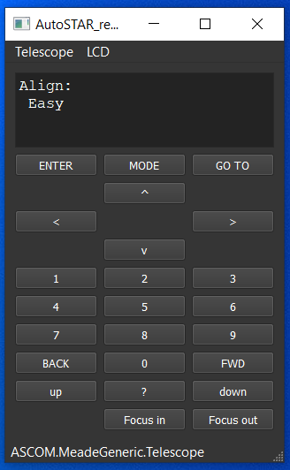

# AutoSTAR_remote
This is a GUI to remote control (using ASCOM) the Meade AutoSTAR #497 handheld.

Press [SHIFT] when clicking on "ENTER", "MODE" or "GO TO" to generate a long key press.

It requires the ASCOM driver from https://bitbucket.org/cjdskunkworks/meadeautostar497

